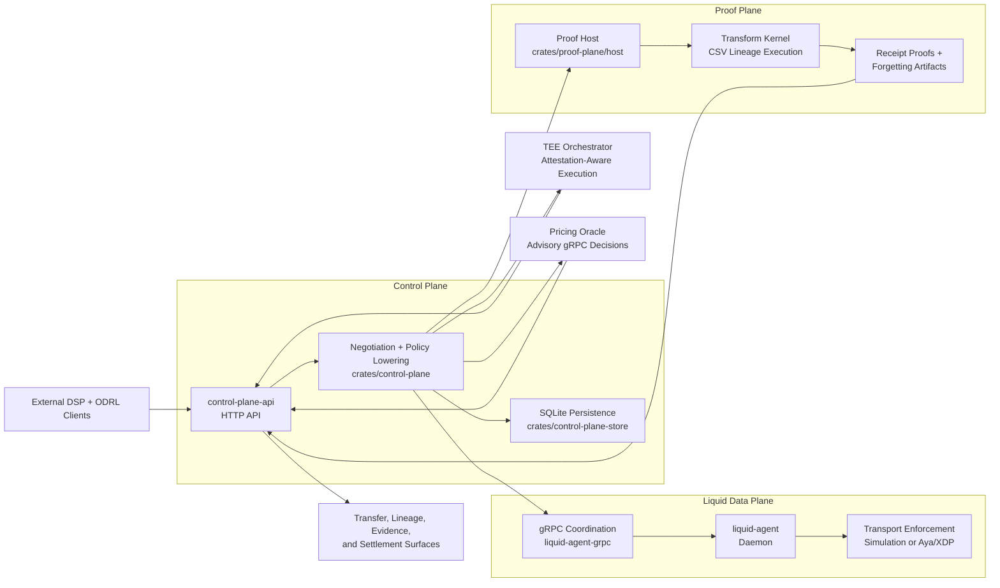

# Liquid-State Dataspace Connector

[](https://github.com/hadijannat/Liquid-State-Dataspace-Connector/actions/workflows/host-ci.yml)
[](Cargo.toml)
[](rust-toolchain.toml)

The Liquid-State Dataspace Connector (LSDC) is a Rust-first dataspace prototype that keeps `DSP + ODRL` at the external boundary, but treats the connector itself as a runtime platform for negotiation, transport enforcement, provenance proofs, attested execution, and advisory pricing. The repo is intentionally strict about truthfulness: the local stack runs real control-plane, agent, proof, and pricing flows today, while recursive proofs, live enclave orchestration, and autonomous contract mutation or billing settlement remain research or future work rather than current runtime claims.

## Architecture At a Glance



The diagram reflects the currently implemented runtime path. Recursive proof rollups, live enclave lifecycle orchestration, and non-advisory pricing or settlement mutation remain future work.

## What LSDC Is

- A control-plane API that negotiates DSP-style contracts and exposes transfer, lineage, evidence, and settlement surfaces.
- A liquid data plane that enforces transport policy through simulated guards or Aya/XDP on Linux.
- A proof and evidence layer that turns approved transforms into lineage records, receipt proofs, and proof-of-forgetting artifacts.
- A TEE and pricing integration surface that pairs attestation-aware execution with advisory gRPC pricing decisions.

## What Exists Today

- DSP contract request and finalize flows with stable raw-ODRL policy hashing and lowering into `RequestedExecutionProfile`.
- Policy truthfulness classification that marks negotiated clauses as `executable`, `metadata_only`, or `rejected`.
- `apps/control-plane-api`, an `axum` + SQLite HTTP service over the control-plane, store, and transport crates.
- `apps/liquid-agent`, a config-driven gRPC daemon that runs real Aya/XDP enforcement on Linux and simulation elsewhere.
- Batch CSV lineage with the default `DevReceiptProofEngine`, proof-of-forgetting, and advisory pricing behind the HTTP API.
- Feature-gated single-hop `RISC Zero` proving plus Nitro-oriented attestation flows for `nitro-dev` and pinned-measurement validation for `nitro-live`.
- Startup validation that checks configured transport, proof, and TEE intent against the runtime components actually instantiated.

## What Is Explicitly Future Work

- Recursive proof rollups.
- Live enclave lifecycle orchestration on Nitro-capable runners.
- Non-advisory pricing, contract mutation, or billing settlement.
- Richer ODRL enforcement beyond the currently executable subset.

Implemented behavior belongs in [docs/current-state.md](docs/current-state.md). Long-horizon architecture and research direction belong in [docs/research/README.md](docs/research/README.md).

## How The Diagram Maps To The Repo

- HTTP entrypoint: `apps/control-plane-api` hosts the `axum` service and wires together the control-plane, transport, proof, TEE, and pricing integrations.
- Control plane modules: `crates/control-plane`, `crates/control-plane-http`, and `crates/control-plane-store` own negotiation, policy lowering, route handling, and SQLite-backed state.
- Liquid data plane: `apps/liquid-agent`, `crates/liquid-agent-grpc`, `crates/liquid-data-plane/agent-core`, and `crates/liquid-data-plane/ebpf` implement agent communication and transport enforcement.
- Proof, TEE, and pricing integrations: `crates/proof-plane/host`, `crates/proof-plane/transform-kernel`, `crates/tee-orchestrator`, `proto/pricing/v1/pricing.proto`, and `python/pricing-oracle` provide lineage execution, evidence generation, attestation-aware execution hooks, and advisory pricing.

## Repo Layout

- Apps: `apps/control-plane-api` and `apps/liquid-agent` are the binary entrypoints. Both binaries are config-driven and currently expose `--config <CONFIG>` as their runtime interface.
- Core crates: `crates/lsdc-common`, `crates/lsdc-config`, `crates/lsdc-ports`, and `crates/lsdc-service-types` hold shared types, config loading, runtime ports, and HTTP DTOs.
- Data plane, proof, and TEE crates: `crates/liquid-data-plane/*`, `crates/proof-plane/*`, and `crates/tee-orchestrator` contain the execution-heavy subsystems.
- The embedded `crates/proof-plane/risc0-guest` package is used only by the feature-gated `RISC Zero` build and is not a root workspace member.
- Python oracle: `python/pricing-oracle` is the advisory pricing sidecar generated from the repo-level pricing proto.
- Fixtures: `fixtures/` contains the reusable ODRL policy, CSV input, transform manifest, proof outputs, and Nitro attestation samples used by tests and the reference flow.

## Quickstart

Prerequisites:

- Ubuntu or Debian if you want to use the bootstrap script as-is.
- `curl` and `sudo` so the script can install the Rust toolchain and required system packages.
- Linux with elevated privileges only if you want to run the real XDP path; the default reference stack works in simulated mode.

Bootstrap the repo:

```bash
./scripts/bootstrap-ubuntu.sh
```

That script installs the nightly Rust toolchain with `rustfmt`, `clippy`, and `rust-src`, provisions system packages for the data plane, and creates `.venv` for the pricing oracle.

Verify the default Rust and Python surfaces:

```bash
cargo xtask verify-repo
cargo test --workspace
.venv/bin/python -m pytest python/pricing-oracle/tests
```

Before running the reference stack outside tests, set the control-plane bearer token plus the proof, forgetting, and pricing signing secrets. The demo script exports development values for the stack processes it launches, enables explicit dev-mode fallbacks with `LSDC_ALLOW_DEV_DEFAULTS=1`, and prints the bearer token you will need from any separate shell that calls the protected HTTP routes.

Start the local Phase 3 reference stack:

```bash
./scripts/run-phase3-demo.sh
```

This launches the Python pricing oracle, three simulated `liquid-agent` nodes, and three `control-plane-api` nodes using the configs in `configs/phase3/`.

Optional Linux XDP path:

```bash
cargo xtask build-ebpf
sudo cargo test -p liquid-agent --test linux_agent_tests -- --ignored
```

Optional feature-gated `RISC Zero` path:

```bash
curl -L https://risczero.com/install | bash
export PATH="$HOME/.risc0/bin:$PATH"
rzup install cargo-risczero 5.0.0-rc.1
rzup install rust 1.91.1
cargo test -p control-plane-api --features risc0 --test risc0_http_tests
```

The `RISC Zero` path is off by default and requires both the `cargo-risczero` CLI and the matching guest Rust toolchain on the machine that runs it.

## Reference Stack And Endpoints

Default reference stack addresses:

- tier-a API: `http://127.0.0.1:7001`
- tier-b API: `http://127.0.0.1:7002`
- tier-c API: `http://127.0.0.1:7003`
- pricing health: `http://127.0.0.1:8000/health`

Main HTTP routes exposed by `control-plane-api`:

- `GET /health`
- `POST /dsp/contracts/request`
- `POST /dsp/contracts/finalize`
- `POST /dsp/transfers/start`
- `POST /dsp/transfers/:transfer_id/complete`
- `POST /lsdc/lineage/jobs`
- `GET /lsdc/lineage/jobs/:job_id`
- `POST /lsdc/evidence/verify-chain`
- `GET /lsdc/agreements/:agreement_id/settlement`

`GET /health` is intentionally public. Every other route requires `Authorization: Bearer <LSDC_API_BEARER_TOKEN>`.

## Example Flow

The default repo flow is a three-party A -> B -> C CSV lineage demo backed by simulated agents, `nitro-dev`, the default `DevReceiptProofEngine`, and advisory pricing:

1. Submit a contract request to `/dsp/contracts/request` using the policy in `fixtures/odrl/supported_policy.json`.
2. Finalize the returned offer through `/dsp/contracts/finalize` to persist the agreement and inspect the requested versus actual execution profile.
3. Submit a lineage job to `/lsdc/lineage/jobs` using `fixtures/csv/lineage_input.csv` and `fixtures/liquid/analytics_manifest.json`, then poll `/lsdc/lineage/jobs/:job_id` for completion.
4. Inspect `/lsdc/evidence/verify-chain` and `/lsdc/agreements/:agreement_id/settlement` to verify emitted evidence and retrieve the advisory settlement decision. Chain verification is receipt-aware: the endpoint verifies each receipt against its declared backend and rejects broken `prior_receipt_hash` links even when the current node is running a different proof backend.

## Security Defaults

- `LSDC_API_BEARER_TOKEN` is required for all non-health HTTP routes.
- `LSDC_PROOF_SECRET`, `LSDC_FORGETTING_SECRET`, and `LSDC_PRICING_SECRET` must be set unless `LSDC_ALLOW_DEV_DEFAULTS=1`.
- Insecure pricing gRPC is development-only. It is allowed only for loopback binds and only when `LSDC_ALLOW_DEV_DEFAULTS=1`.
- Dynamic transport session ports keep the current hash-derived port as the preferred choice, then linearly probe `20000..60000` to avoid active-selector collisions on the same interface and protocol.

For the exact implemented runtime contract, use [docs/current-state.md](docs/current-state.md). For the aspirational extensions beyond this flow, use [docs/research/README.md](docs/research/README.md).

## Documentation Map

- Current state: [docs/current-state.md](docs/current-state.md) for the truthful runtime model, supported ODRL subset, implemented backends, and verification commands.
- Roadmap: [docs/roadmap.md](docs/roadmap.md) for the next delivery sequence and what is being hardened next.
- Vision: [docs/vision.md](docs/vision.md) for the long-horizon connector model without implying current implementation.
- Research track: [docs/research/README.md](docs/research/README.md) for the RFC-style pillar documents on transport, recursive proofs, TEE brokering, and pricing.
