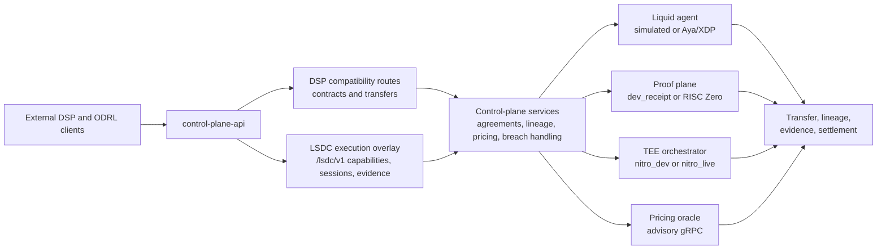

# Liquid-State Dataspace Connector

[](https://github.com/hadijannat/Liquid-State-Dataspace-Connector/actions/workflows/host-ci.yml)
[](Cargo.toml)
[](rust-toolchain.toml)

The Liquid-State Dataspace Connector (LSDC) is a Rust-first dataspace runtime with a DSP-compatible HTTP boundary and an additive LSDC execution overlay. The repo is intentionally strict about truthfulness: it documents the default Phase 3 stack that runs today, the advanced modes that are implemented but non-default, and the research track that is still out of scope for current runtime claims.

- Default reference stack: three `control-plane-api` nodes, three simulated `liquid-agent` nodes, and the Python pricing oracle.
- Public surface: DSP contract and transfer routes plus additive `/lsdc/v1/*` execution-overlay routes.
- Implemented non-default modes: Linux Aya/XDP transport, feature-gated `RISC Zero`, `nitro_live`, AWS Nitro attestation verification, and AWS KMS-backed attested key release when configured.
- Explicit future work: recursive proof rollups, live enclave lifecycle orchestration, autonomous contract mutation or settlement, and richer enforcement beyond the implemented executable subset.

## Architecture



Static fallback: [docs/architecture.svg](docs/architecture.svg) for renderers that do not support Mermaid.

The default Phase 3 demo runs this flow with simulated transport, `dev_receipt`, `nitro_dev`, and advisory pricing. The same HTTP service also exposes the newer execution-overlay routes alongside the older DSP and lineage compatibility paths, and `/health` reports both configured and realized backends.

## What Runs Today

| Layer | Default reference stack | Implemented non-default modes |
| --- | --- | --- |
| Transport | `simulated` via `liquid-agent` | Aya/XDP on privileged Linux runners |
| Proof | `dev_receipt` | Feature-gated `RISC Zero` single-hop proof path |
| TEE | `nitro_dev` | `nitro_live` with AWS Nitro attestation verification and AWS KMS-backed attested key release when configured |
| Pricing | Advisory gRPC decisions | Same advisory model; no autonomous mutation or billing settlement |
| Public APIs | DSP compatibility routes plus lineage, evidence, and settlement compatibility views | `/lsdc/v1/*` execution-overlay routes for capabilities, sessions, attestation evidence, transparency receipts, and DAG verification |

LSDC does not currently claim:

- recursive proof rollups
- live enclave lifecycle orchestration on Nitro-capable infrastructure
- autonomous pricing, contract mutation, or ledger settlement
- richer enforcement beyond the currently executable transport, proof, attestation, and evidence paths

## Quickstart

Prerequisites:

- Ubuntu or Debian if you want to use the bootstrap script as-is
- `curl` and `sudo` so the script can install Rust and system packages
- Linux with elevated privileges only if you want the real XDP path; the default reference stack runs in simulated mode

Bootstrap the repo:

```bash
./scripts/bootstrap-ubuntu.sh
```

Verify the Rust and Python surfaces:

```bash
cargo xtask verify-repo
cargo test --workspace
.venv/bin/python -m pytest python/pricing-oracle/tests
```

Start the default Phase 3 reference stack:

```bash
./scripts/run-phase3-demo.sh
```

That script launches:

- three `control-plane-api` processes on `127.0.0.1:7001`, `:7002`, and `:7003`
- three simulated `liquid-agent` processes on `127.0.0.1:7101`, `:7102`, and `:7103`
- the Python pricing oracle with health on `http://127.0.0.1:8000/health`

It also exports explicit development values for the launched processes, enables `LSDC_ALLOW_DEV_DEFAULTS=1`, and prints the bearer token required for protected HTTP routes from any separate shell.

For manual startup and deeper stack details, use [docs/phase3-reference-stack.md](docs/phase3-reference-stack.md) and [docs/current-state.md](docs/current-state.md).

## API Surface

`GET /health` is intentionally public. Every other route requires `Authorization: Bearer <LSDC_API_BEARER_TOKEN>`.

DSP compatibility routes:

- `POST /dsp/contracts/request`
- `POST /dsp/contracts/finalize`
- `POST /dsp/transfers/start`
- `POST /dsp/transfers/:transfer_id/complete`

Compatibility runtime routes:

- `POST /lsdc/lineage/jobs`
- `GET /lsdc/lineage/jobs/:job_id`
- `POST /lsdc/evidence/verify-chain`
- `GET /lsdc/agreements/:agreement_id/settlement`

Execution-overlay routes:

- `GET /lsdc/v1/capabilities`
- `POST /lsdc/v1/sessions`
- `POST /lsdc/v1/sessions/:session_id/challenges`
- `POST /lsdc/v1/sessions/:session_id/attestation-evidence`
- `POST /lsdc/v1/evidence/statements`
- `GET /lsdc/v1/evidence/statements/:statement_id/receipt`
- `POST /lsdc/v1/evidence/verify`

The older lineage, evidence, and settlement routes remain available as compatibility views over the same execution and evidence model that backs the `/lsdc/v1/*` overlay.

## Runtime Modes

- Transport: `liquid-agent` defaults to simulated enforcement. Aya/XDP is available on Linux and built with `cargo xtask build-ebpf`.
- Proof: `proof_backend = "dev_receipt"` is the default. `risc_zero` is supported behind the `risc0` feature and the external guest toolchain.
- TEE: `tee_backend = "nitro_dev"` is the default. `nitro_live` is supported as a non-default mode with AWS Nitro attestation verification and optional AWS KMS-backed attested key release.
- Pricing: the pricing plane is advisory-only gRPC. Insecure `http://` pricing endpoints are development-only and must stay on loopback with `LSDC_ALLOW_DEV_DEFAULTS=1`.

Non-default `nitro_live` configuration uses the existing control-plane config knobs:

- `key_broker_backend`
- `aws_region`
- `kms_key_id`
- `nitro_trust_bundle_path`
- `nitro_live_attestation_path`

Those are supported runtime configuration fields, not new public schema work. The default Phase 3 configs in [`configs/phase3/`](configs/phase3/) still run `nitro_dev`.

## Repo Layout

- `apps/control-plane-api` and `apps/liquid-agent` are the binary entrypoints.
- `crates/control-plane`, `crates/control-plane-http`, and `crates/control-plane-store` own orchestration, HTTP handlers, and SQLite-backed persistence.
- `crates/lsdc-policy`, `crates/lsdc-contracts`, `crates/lsdc-evidence`, `crates/lsdc-execution-protocol`, `crates/lsdc-runtime-model`, `crates/lsdc-config`, `crates/lsdc-ports`, and `crates/lsdc-service-types` hold the domain, config, runtime port, and service types.
- `crates/liquid-agent-grpc` provides the shared gRPC contract between the API-facing stack and `liquid-agent`.
- `crates/liquid-data-plane/*`, `crates/proof-plane/*`, `crates/tee-orchestrator`, and `crates/receipt-log` implement transport, proving, attestation, key release, and transparency behavior.
- `crates/proof-plane/risc0-guest` supports the feature-gated `RISC Zero` path and is not a root workspace member.
- `python/pricing-oracle`, `proto/pricing/v1/pricing.proto`, and `fixtures/` support the advisory pricing sidecar and the reference flow.

## Documentation Map

- [docs/current-state.md](docs/current-state.md): implemented runtime model, supported modes, and verification commands
- [docs/phase3-reference-stack.md](docs/phase3-reference-stack.md): local three-node demo topology and flow
- [docs/roadmap.md](docs/roadmap.md): active delivery sequence
- [docs/vision.md](docs/vision.md): long-horizon architecture without implying current runtime support
- [docs/research/README.md](docs/research/README.md): RFC-style research track for transport, recursive proofs, TEE brokering, and pricing
