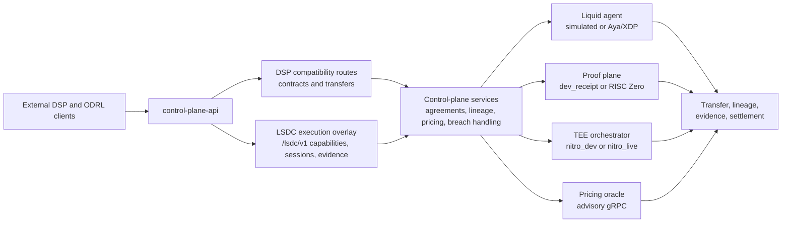

# Liquid-State Dataspace Connector

[](https://github.com/hadijannat/Liquid-State-Dataspace-Connector/actions/workflows/host-ci.yml)
[](Cargo.toml)
[](rust-toolchain.toml)

## Status / Truthfulness Boundary

> This is a truthful prototype.
>
> - The default local stack is the Phase 3 reference stack.
> - Advanced modes such as Linux eXpress Data Path (XDP), feature-gated `RISC Zero`, and `nitro_live` are implemented but non-default.
> - As of March 11, 2026, no GitHub releases are published for this repository.
> - Rust nightly is required by the checked-in toolchain.
> - The repo documents what the runtime actually does today and keeps future work clearly separate.

## What LSDC Is

The Liquid-State Dataspace Connector (LSDC) is a Rust-first dataspace runtime that keeps the Data Space Protocol (DSP) and Open Digital Rights Language (ODRL) at the external boundary, while the connector itself coordinates transport enforcement, proof generation, trusted execution environment (TEE) appraisal, and advisory pricing.

- The default runnable stack is three `control-plane-api` nodes, three simulated `liquid-agent` nodes, and the Python pricing oracle.
- The public HTTP surface includes DSP contract and transfer routes plus additive LSDC execution-overlay routes under `/lsdc/v1/*`.
- The implementation is explicit about requested capability intent versus the backends that actually ran.

## What Runs Today

- The default demo runs simulated transport, the dev receipt backend, `nitro_dev`, local transparency receipts, and advisory pricing.
- The control plane exposes both the legacy compatibility routes and the newer execution-overlay routes on the same service.
- `/health` reports configured backends, realized backends, feature flags, and execution-overlay metadata.

## What Is Feature-Gated

- Linux Aya/XDP transport enforcement is implemented for privileged Linux runners and is not the default local path.
- `RISC Zero` recursive transform chaining and receipt composition are implemented behind the `risc0` feature and the external guest toolchain.
- `nitro_live` support exists with AWS Nitro attestation verification and AWS KMS-backed key release when explicitly configured, but it is not enabled by the default Phase 3 demo.

## What Is Explicitly Out Of Scope Today

- Live enclave lifecycle orchestration on Nitro-capable infrastructure.
- Autonomous pricing, contract mutation, or ledger settlement.
- Hardware-rooted deletion proof in the default stack.
- Richer enforcement beyond the currently executable transport, proof, attestation, and evidence subset.

## 5-Minute Local Demo

The fastest path is Ubuntu or Debian with the bootstrap script. The default simulated demo itself is runnable on macOS and Linux without elevated privileges once the toolchain and Python environment exist.

```bash
./scripts/bootstrap-ubuntu.sh
cargo xtask verify-repo
cargo test --workspace
.venv/bin/python -m pytest python/pricing-oracle/tests
./scripts/run-phase3-demo.sh

curl http://127.0.0.1:7001/health
curl -H "Authorization: Bearer phase3-demo-token" \
  http://127.0.0.1:7001/lsdc/v1/capabilities
```

If you override `LSDC_API_BEARER_TOKEN`, substitute the value printed by `./scripts/run-phase3-demo.sh` in the authenticated `curl` command.

### Runtime Matrix

| Mode | Default | Requirements | Verify command | CI lane |
| --- | --- | --- | --- | --- |
| Local simulated Phase 3 | Yes | Rust nightly, Python 3.11 virtualenv, no special privileges | `./scripts/run-phase3-demo.sh` | `Host CI` |
| Linux XDP | No | Privileged Linux, `clang`, `llvm`, `libelf`, `libpcap`, `bpftool` | `cargo xtask build-ebpf` and `sudo cargo test -p liquid-agent --test linux_agent_tests -- --ignored` | `Linux XDP` |
| `RISC Zero` | No | `rzup`, `cargo-risczero 5.0.0-rc.1`, guest Rust `1.91.1`, `--features risc0` | `cargo test -p proof-plane-host --features risc0` and `cargo test -p control-plane-api --features risc0 --test risc0_http_tests` | `Proof Nightly` |
| `nitro_live` / Nitro integration | No | Explicit `tee_backend = nitro_live`, `key_broker_backend = aws_kms`, `aws_region`, `kms_key_id`; Nitro runner for the integration lane | `cargo test -p tee-orchestrator` and `cargo test -p control-plane-api --test http_api_tests test_phase3_three_party_demo_flow` | `Host CI` and `Nitro Integration` |

## Expected Services And Ports

When the default demo is up, these services should be reachable:

| Component | Address |
| --- | --- |
| tier-a API | `http://127.0.0.1:7001` |
| tier-b API | `http://127.0.0.1:7002` |
| tier-c API | `http://127.0.0.1:7003` |
| tier-a agent | `127.0.0.1:7101` |
| tier-b agent | `127.0.0.1:7102` |
| tier-c agent | `127.0.0.1:7103` |
| pricing gRPC | `127.0.0.1:50051` |
| pricing health | `http://127.0.0.1:8000/health` |

The launcher exports `phase3-demo-token` as the default bearer token unless you override it. By default, all agents run in simulated mode, so the Phase 3 demo works on macOS and Linux without privileged networking.

## Demo Flow

The reference A -> B -> C walkthrough is:

1. Finalize an agreement on `tier-a` for `tier-b`.
2. Start a guarded transfer on `tier-a`.
3. Submit a lineage job on `tier-b` with the finalized agreement and source CSV.
4. Finalize a downstream agreement on `tier-b` for `tier-c`.
5. Submit a downstream lineage job on `tier-c` with the upstream receipt as `prior_receipt`.
6. Verify the two-hop evidence path.
7. Inspect settlement on `tier-b` and `tier-c`.

The compatibility demo uses `/lsdc/evidence/verify-chain` for the two-hop receipt check. The newer execution-overlay path also exposes `/lsdc/v1/evidence/verify` for evidence-DAG plus transparency-receipt verification.

## First API Calls

`GET /health` is intentionally public. Every other route requires `Authorization: Bearer <LSDC_API_BEARER_TOKEN>`.

### Copy-paste checks

```bash
curl http://127.0.0.1:7001/health

curl -H "Authorization: Bearer phase3-demo-token" \
  http://127.0.0.1:7001/lsdc/v1/capabilities
```

`/health` returns node identity, configured backends, realized backends, feature flags, and execution-overlay metadata. `/lsdc/v1/capabilities` returns the advertised capability descriptor, evidence requirements, and whether strict mode and dev backends are allowed.

### Operator view of the HTTP surface

DSP compatibility routes:

- `POST /dsp/contracts/request`
- `POST /dsp/contracts/finalize`
- `POST /dsp/transfers/start`
- `POST /dsp/transfers/:transfer_id/complete`

Compatibility runtime routes:

- `POST /lsdc/lineage/jobs`
- `GET /lsdc/lineage/jobs/:job_id`
- `POST /lsdc/evidence/verify-chain`
- `GET /lsdc/agreements/:agreement_id/settlement`

Execution-overlay routes:

- `GET /lsdc/v1/capabilities`
- `POST /lsdc/v1/sessions`
- `POST /lsdc/v1/sessions/:session_id/challenges`
- `POST /lsdc/v1/sessions/:session_id/attestation-evidence`
- `POST /lsdc/v1/evidence/statements`
- `GET /lsdc/v1/evidence/statements/:statement_id/receipt`
- `POST /lsdc/v1/evidence/verify`

### `POST /lsdc/lineage/jobs` request shape

The lineage endpoint accepts:

- `agreement`: the `ContractAgreement` returned by `/dsp/contracts/finalize`
- `input_csv_utf8`: the workload as UTF-8 CSV, for example [fixtures/csv/lineage_input.csv](fixtures/csv/lineage_input.csv)
- `manifest`: a transform manifest, for example [fixtures/liquid/analytics_manifest.json](fixtures/liquid/analytics_manifest.json)
- `current_price`: the current commercial baseline for pricing
- `metrics`: the training metrics window used by the pricing oracle
- `prior_receipt`: optional upstream receipt for downstream lineage hops
- `execution_bindings`: optional overlay bindings for session-aware execution

## Architecture



Static fallback: [docs/architecture.svg](docs/architecture.svg) for renderers that do not support Mermaid.

The default Phase 3 demo runs this graph with simulated transport, `dev_receipt`, `nitro_dev`, local transparency receipts, and advisory pricing. Negotiated intent is not treated as proof that `RISC Zero` or `nitro_live` actually ran.

## Configuration And Secrets

| Variable | Required in normal mode | Demo/default behavior | Subsystem |
| --- | --- | --- | --- |
| `LSDC_API_BEARER_TOKEN` | Yes | `./scripts/run-phase3-demo.sh` exports `phase3-demo-token` | Control-plane API auth |
| `LSDC_PROOF_SECRET` | Yes unless `LSDC_ALLOW_DEV_DEFAULTS=1` | Demo exports `phase3-proof-secret` | Proof signing |
| `LSDC_FORGETTING_SECRET` | Yes unless `LSDC_ALLOW_DEV_DEFAULTS=1` | Demo exports `phase3-forgetting-secret` | Teardown / forgetting evidence |
| `LSDC_PRICING_SECRET` | Yes unless `LSDC_ALLOW_DEV_DEFAULTS=1` | Demo exports `phase3-pricing-secret` | Pricing oracle signatures |
| `LSDC_ATTESTATION_SECRET` | No | Demo exports `phase3-attestation-secret`; code also has a built-in dev fallback | Local attestation signing and verification |
| `LSDC_ALLOW_DEV_DEFAULTS` | No | Demo sets `1` to enable explicit dev-only fallbacks and loopback-only insecure pricing | Cross-cutting development guard |

Normal mode should provide real secrets explicitly. Development mode is opt-in and should stay limited to local or loopback-only environments.

## Supported Policy Subset

The executable subset documented in [docs/current-state.md](docs/current-state.md) is:

| Category | Supported today | Notes |
| --- | --- | --- |
| Actions | `read`, `transfer`, `anonymize` | These drive the current transport and transform paths |
| Constraints | `count`, `purpose`, `validUntil` | Count and purpose are enforced or checked; `validUntil` is surfaced in truthfulness data |
| Duties | `transform-required`, `delete-after` | Used by the transform kernel and teardown evidence flow |
| Overlay operands | `teeImageSha384`, `attestationFreshnessSeconds`, `proofKind`, `keyReleaseProfile`, `maxEgressBytes`, `deletionMode` | Advertised and classified through the execution overlay |
| Not fully executable | Unsupported overlay clauses and `spatial` | These remain `metadata_only` or strict-mode rejected depending on context |

Session binding and transparency registration requirements live in the execution overlay, not in the ODRL profile itself.

## Runtime Modes And CI Coverage

| Backend family | Default stack | Implemented non-default path | Requirements | Verification command | CI lane |
| --- | --- | --- | --- | --- | --- |
| Transport | `simulated` via `liquid-agent` | Aya/XDP on privileged Linux | Linux, elevated networking, eBPF toolchain from bootstrap | `cargo xtask build-ebpf` and `sudo cargo test -p liquid-agent --test linux_agent_tests -- --ignored` | `Linux XDP` |
| Proof | `dev_receipt` plus local transparency receipts | `RISC Zero` recursive transform chaining and receipt composition | `rzup`, `cargo-risczero`, guest Rust toolchain, `--features risc0` | `cargo test -p proof-plane-host --features risc0` and `cargo test -p control-plane-api --features risc0 --test risc0_http_tests` | `Proof Nightly` |
| TEE | `nitro_dev` | `nitro_live` with AWS Nitro verification and AWS KMS-backed key release | `tee_backend = nitro_live`, `key_broker_backend = aws_kms`, `aws_region`, `kms_key_id`; Nitro runners for the integration lane | `cargo test -p tee-orchestrator` and `cargo test -p control-plane-api --test http_api_tests test_phase3_three_party_demo_flow` | `Host CI` and `Nitro Integration` |
| Pricing | Advisory gRPC | Same advisory model on other backends | Loopback-only insecure mode requires `LSDC_ALLOW_DEV_DEFAULTS=1` | `.venv/bin/python -m pytest python/pricing-oracle/tests` | `Host CI` |
| API surface | DSP compatibility plus compatibility lineage/settlement views | Additive `/lsdc/v1/*` execution overlay | Bearer token on every non-health route | `curl http://127.0.0.1:7001/health` and authenticated `curl ... /lsdc/v1/capabilities` | Local demo plus integration tests in `Host CI` |

## Try It With Fixtures

- [fixtures/odrl/supported_policy.json](fixtures/odrl/supported_policy.json): supported ODRL sample used for contract request and finalize flows
- [fixtures/liquid/analytics_manifest.json](fixtures/liquid/analytics_manifest.json): transform manifest used by the reference lineage path
- [fixtures/csv/lineage_input.csv](fixtures/csv/lineage_input.csv): canonical CSV input for the A -> B -> C demo
- [fixtures/proof/expected_redacted.csv](fixtures/proof/expected_redacted.csv): expected transformed output for proof-plane and lineage checks
- [fixtures/nitro/live_attestation_material.json](fixtures/nitro/live_attestation_material.json): pinned-measurement sample for `nitro_live` fixture-mode validation

## Repository Map

- `apps/control-plane-api` and `apps/liquid-agent`: binary entrypoints for the HTTP boundary and agent runtime.
- `crates/control-plane`, `crates/control-plane-http`, and `crates/control-plane-store`: orchestration, handlers, persistence, and compatibility views.
- `crates/lsdc-policy`, `crates/lsdc-contracts`, `crates/lsdc-evidence`, `crates/lsdc-execution-protocol`, `crates/lsdc-runtime-model`, `crates/lsdc-ports`, and `crates/lsdc-service-types`: policy, agreement, evidence, execution-overlay, shared runtime ports, and service DTOs.
- `crates/liquid-agent-grpc`, `crates/liquid-data-plane/*`, `crates/proof-plane/*`, `crates/tee-orchestrator`, and `crates/receipt-log`: agent transport contracts, enforcement backends, proof backends, TEE support, and transparency receipts.
- `crates/proof-plane/risc0-guest` supports the feature-gated `RISC Zero` path and is not a root workspace member.
- `python/pricing-oracle`, `proto/pricing/v1/pricing.proto`, and `fixtures/`: pricing sidecar, shared proto, and reusable demo artifacts.

## Docs Map

- Open [docs/current-state.md](docs/current-state.md) when you need the truthful runtime contract, supported policy subset, and backend verification details.
- Open [docs/phase3-reference-stack.md](docs/phase3-reference-stack.md) when you want the three-node topology, the reference flow, or the manual demo narrative.
- Open [docs/roadmap.md](docs/roadmap.md) when you want to see what is being hardened next rather than what is already shipped in this branch.
- Open [docs/vision.md](docs/vision.md) when you want the long-horizon connector direction without implying current implementation support.
- Open [docs/research/README.md](docs/research/README.md) when you want the RFC-style research track for transport, advanced proof systems, TEE brokering, and pricing.

## Development Workflow

Host CI currently runs these commands:

```bash
cargo fmt --all --check
cargo clippy --workspace --all-targets --exclude liquid-data-plane-ebpf -- -D warnings
cargo xtask verify-repo
cargo test --workspace
python -m pytest python/pricing-oracle/tests
```

Opt-in commands for non-default paths:

```bash
# Linux XDP
cargo xtask build-ebpf
sudo cargo test -p liquid-agent --test linux_agent_tests -- --ignored

# RISC Zero
cargo test -p proof-plane-host --features risc0
cargo test -p control-plane-api --features risc0 --test risc0_http_tests

# Protected three-party demo test
cargo test -p control-plane-api --test http_api_tests test_phase3_three_party_demo_flow
```

If you are working locally after `./scripts/bootstrap-ubuntu.sh`, either activate `.venv` or replace `python -m pytest` with `.venv/bin/python -m pytest`.

## Troubleshooting

- Missing `.venv/bin/python`: run `./scripts/bootstrap-ubuntu.sh` first, or create the virtualenv manually and install `python/pricing-oracle[dev]`.
- `401 Unauthorized` on non-health routes: every route except `/health` requires `Authorization: Bearer <LSDC_API_BEARER_TOKEN>`.
- Pricing or secret-related startup failures: `LSDC_PROOF_SECRET`, `LSDC_FORGETTING_SECRET`, and `LSDC_PRICING_SECRET` are required unless `LSDC_ALLOW_DEV_DEFAULTS=1`.
- Confusion about insecure pricing endpoints: insecure `http://` pricing is development-only, loopback-only, and gated behind `LSDC_ALLOW_DEV_DEFAULTS=1`.
- Linux XDP failures on macOS or unprivileged Linux: the real XDP path requires privileged Linux plus the eBPF toolchain; use the default simulated mode otherwise.
- `RISC Zero` tests fail before compile: install `rzup`, `cargo-risczero 5.0.0-rc.1`, and the guest Rust `1.91.1` toolchain first.

## Roadmap

The current delivery sequence lives in [docs/roadmap.md](docs/roadmap.md). Use it to track what is being hardened next without turning roadmap items into present-tense runtime claims.

## License

Apache-2.0. See [Cargo.toml](Cargo.toml).
